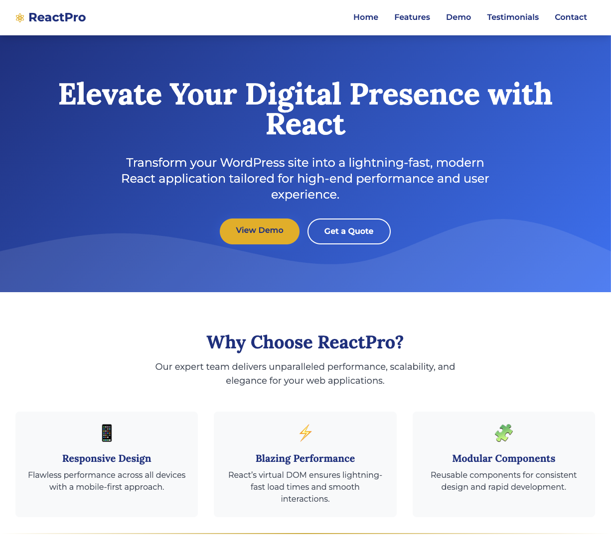

# ReactPro - WordPress to React Conversion

Premium WordPress to React conversion landing page. Deploy in minutes, no local setup required.

[](https://vercel.com/new/clone?repository-url=https%3A%2F%2Fgithub.com%2Fquantnexusai%2Freactpro-conversion&env=NEXT_PUBLIC_SUPABASE_URL,NEXT_PUBLIC_SUPABASE_PUBLISHABLE_KEY,ANTHROPIC_API_KEY&envDescription=Get%20keys%20from%20Supabase%20and%20Anthropic&envLink=https%3A%2F%2Fgithub.com%2Fquantnexusai%2Freactpro-conversion%23environment-variables&project-name=reactpro-conversion&repository-name=reactpro-conversion)

## Features

- **Blazing Fast Performance** - Built with Next.js 15 for optimal speed and SEO
- **Claude AI Integration** - Interactive chat widget powered by Claude for instant answers
- **Responsive Design** - Flawless experience across all devices
- **One-Click Deploy** - Deploy to Vercel with a single click
- **Local Preview Mode** - Explore the UI without any API keys

## Quick Start

### Step 1: Get Your API Keys

Before deploying, you'll need:

1. **Supabase** - Create a free project at [supabase.com](https://supabase.com)
   - Go to Settings > API to get your URL and publishable key

2. **Anthropic** - Get an API key at [console.anthropic.com](https://console.anthropic.com)

### Step 2: Deploy to Vercel

Click the deploy button above and enter your API keys when prompted.

### Step 3: Set Up Database

Run `supabase/schema.sql` in your Supabase SQL Editor to create the required tables.

### Step 4: Done!

Your app is now fully functional.

## Environment Variables

| Variable | Description | Required |
|----------|-------------|----------|
| `NEXT_PUBLIC_SUPABASE_URL` | Supabase project URL | Yes |
| `NEXT_PUBLIC_SUPABASE_PUBLISHABLE_KEY` | Supabase publishable key | Yes |
| `ANTHROPIC_API_KEY` | Anthropic Claude API key | Yes |

## Local Development

For local UI development without API keys, the app includes sample data:

```bash
# Clone the repository
git clone https://github.com/quantnexusai/reactpro-conversion.git
cd reactpro-conversion

# Install dependencies
npm install

# Start development server
npm run dev
```

Open [http://localhost:3000](http://localhost:3000) to see the app with sample data.

**Note:** This is for development only. Deployment requires valid API keys.

## Tech Stack

- **Framework:** Next.js 15 (App Router)
- **Styling:** Tailwind CSS
- **Database:** Supabase (PostgreSQL)
- **AI:** Claude API (Anthropic)
- **Hosting:** Vercel
- **Icons:** Lucide React

## Project Structure

```
├── src/
│   ├── app/                 # Next.js pages and API routes
│   ├── components/          # React components
│   └── lib/                 # Utilities and types
├── supabase/
│   └── schema.sql          # Database schema
├── public/                  # Static assets
└── package.json
```

## Screenshots

### Homepage


## Contributing

See [CONTRIBUTING.md](CONTRIBUTING.md) for local development setup.

## Need Help?

For assistance with deployment, configuration, or customization (MCP servers, AI agents, etc.), contact us at **ari@quantnexus.ai**

## License

MIT License - use freely for personal or commercial projects.

---

Built with React by [QuantNexus AI](https://quantnexus.ai)
