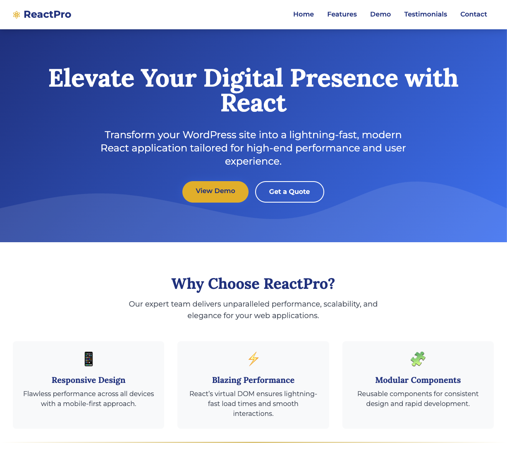

# ReactPro - WordPress to React Conversion

Welcome to **ReactPro**, a premium service for transforming your WordPress site into a modern, high-performance React application. This repository contains a stunning landing page designed to attract high-end clients, showcasing the benefits of React over traditional WordPress.

## Features

* **Blazing Fast Performance**: Up to 70% faster load times with React's virtual DOM.
* **Responsive Design**: Seamless adaptation to all devices, from mobile to desktop.
* **Modular Components**: Reusable React components for scalability and consistency.
* **Elegant UI**: Sophisticated design with smooth animations and a luxurious aesthetic.
* **SEO Optimized**: Maintain or improve search engine rankings.

## Screenshots

### Homepage

*Our sleek and modern homepage showcasing the ReactPro conversion service*

### Hero Section
*Insert hero section screenshot description here*

### Features Section
*Insert features section screenshot description here*

## Getting Started

### Prerequisites
* A modern web browser (Chrome, Firefox, Safari, etc.)
* Git installed on your local machine
* A GitHub account

### Installation
1. **Clone the Repository**

```bash
git clone https://github.com/quantnexusai/reactpro-conversion.git
cd reactpro-conversion
```

2. **Open the Site**
   * Open `index.html` in a web browser to view the site locally.
   * No build step is required as the site uses CDN-hosted React, Tailwind CSS, and Babel.

3. **Deploy to GitHub Pages** (Optional)
   * Push the repository to GitHub.
   * Go to **Settings** > **Pages** in your repository.
   * Set the source to the `main` branch and `/ (root)` folder.
   * Access the live site at `https://quantnexusai.github.io/reactpro-conversion/`.

## Usage

* **Customize Content**: Edit `index.html` to update text, colors, or add new sections.
* **Add Screenshots**: Place new images in the `assets/` folder and update `README.md` with their paths.
* **Enhance Functionality**: Convert the site to a full React app with Vite or Webpack for production use.

## Contributing

Contributions are welcome! Please follow these steps:
1. Fork the repository.
2. Create a new branch (`git checkout -b feature/your-feature`).
3. Commit your changes (`git commit -m "Add your feature"`).
4. Push to the branch (`git push origin feature/your-feature`).
5. Open a pull request.

## License

This project is licensed under the MIT License.

## Contact

For inquiries, reach out to ari@quantnexus.ai or visit our website.

Built with 💙 by Ari with React